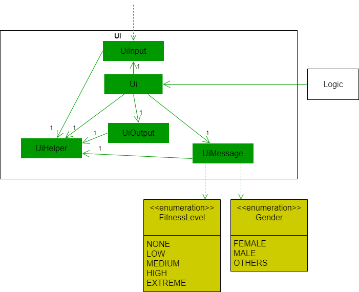
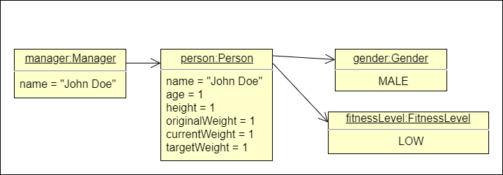
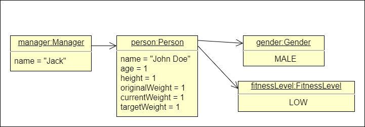
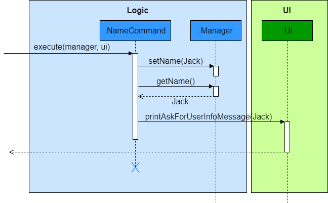
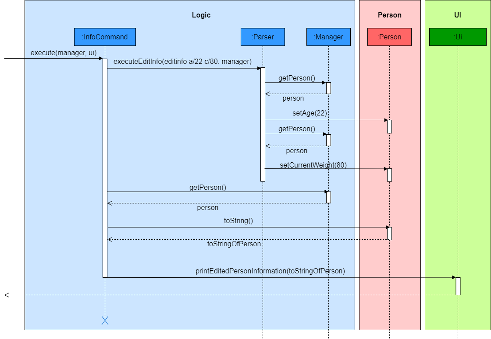
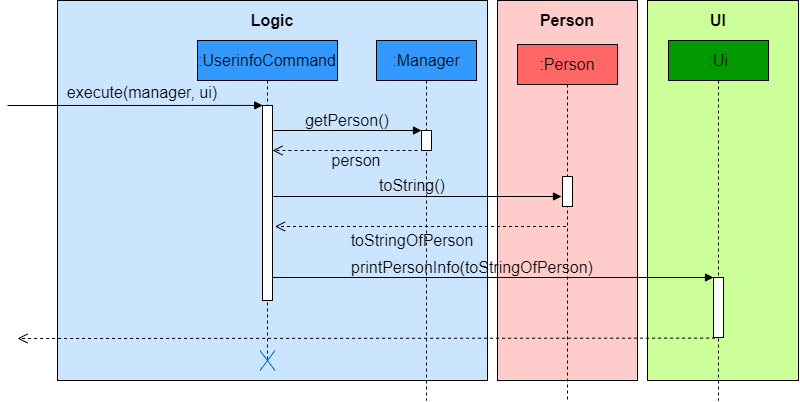

# Developer Guide

* Table of Contents
{:toc} 

## Design 

### UI component


**API**: [`Ui.java`](https://github.com/AY2021S1-CS2113-T14-4/tp/blob/master/src/main/java/seedu/dietbook/ui/Ui.java)

The `UI` component makes use of the following classes:

* [`Ui`](https://github.com/AY2021S1-CS2113-T14-4/tp/blob/master/src/main/java/seedu/dietbook/ui/Ui.java): Responsible for communication between the other classes in the `UI` component and with the `Logic` component.
* [`UiHelper`](https://github.com/AY2021S1-CS2113-T14-4/tp/blob/master/src/main/java/seedu/dietbook/ui/UiHelper.java): Responsible for providing helper methods to the other classes in the `UI` component.
* [`UiInput`](https://github.com/AY2021S1-CS2113-T14-4/tp/blob/master/src/main/java/seedu/dietbook/ui/UiInput.java): Responsible for reading in the user commands and checking if it is empty.
* [`UiOuput`](https://github.com/AY2021S1-CS2113-T14-4/tp/blob/master/src/main/java/seedu/dietbook/ui/UiOutput.java): Responsible for printing the outputs.
* [`UiMessage`](https://github.com/AY2021S1-CS2113-T14-4/tp/blob/master/src/main/java/seedu/dietbook/ui/UiMessage.java): Responsible for storing output messages in methods so that they can be retrieved and printed when necessary.
    
The `UiMessage` class has **dependencies** with the following enumeration classes:

* **Rationale**: Increased coupling was sacrificed to reduce code duplicates and increase ease of code extension/editing.
* [`FitnessLevel`](https://github.com/AY2021S1-CS2113-T14-4/tp/blob/master/src/main/java/seedu/dietbook/person/FitnessLevel.java): Descriptions of the five `FitnessLevel` are required in `UiMessage#getAskForUserInfoMessage(String name)` as shown in the code snippet below.
```             
+ "- Your fitness level, represented by a number from 1 to 5." + UiHelper.LINE_SEPARATOR
   + "  1 = " + FitnessLevel.NONE.getDescription() + UiHelper.LINE_SEPARATOR
   + "  2 = " + FitnessLevel.LOW.getDescription() + UiHelper.LINE_SEPARATOR
   + "  3 = " + FitnessLevel.MEDIUM.getDescription() + UiHelper.LINE_SEPARATOR
   + "  4 = " + FitnessLevel.HIGH.getDescription() + UiHelper.LINE_SEPARATOR
   + "  5 = " + FitnessLevel.EXTREME.getDescription() + UiHelper.LINE_SEPARATOR             
```
* [`Gender`](https://github.com/AY2021S1-CS2113-T14-4/tp/blob/master/src/main/java/seedu/dietbook/person/Gender.java): Descriptions of the three `Gender` are required in `UiMessage#getAskForUserInfoMessage(String name)`as shown in the code snippet below.
```             
 "- Your gender either F for " + Gender.FEMALE.getDescription() + " or M for "
 + Gender.MALE.getDescription() + " or O for " + Gender.OTHERS.getDescription() + "."
```

In summary, the `UI` component,
* Takes in user command, ensure that it is not empty before passing it to the `Logic` component for command execution.
* Updates the user about any changes in the data after executing the command or errors encountered when executing the commands as instructed by the `Logic` component.

## Implementation

### Enter user information feature

#### Implementation

This feature allows users to enter their personal information into the system so that they can be used for tracking diet progress and calorie recommendation calculation. This feature and its associated command words is **only used during the initial setup of the application**. Any subsequent editing of the user information can be done using the [Edit user information feature](#edit-user-information-feature).

**Commands words used**:

* [`name`](https://ay2021s1-cs2113-t14-4.github.io/tp/UserGuide.html#entering-username-name): Saves the user's name or nickname into the application. 
* [`info`](https://ay2021s1-cs2113-t14-4.github.io/tp/UserGuide.html#entering-user-information-info): Saves the user's age, gender, height, fitness level, original, current and target weight into the application. 

**Main classes and methods used**: 

* [`Manager`](https://github.com/AY2021S1-CS2113-T14-4/tp/blob/master/src/main/java/seedu/dietbook/Manager.java): Stores a `Person` object.
    * `Manager#setPerson(String newName, Gender newGender, int newAge, int newHeight, int newOriginalWeight, int newCurrentWeight, int newTargetWeight, FitnessLevel newFitnessLevel)`: Calls a method in `Person` class (listed below) to set the attribute values of the `Person` object.
* [`Person`](https://github.com/AY2021S1-CS2113-T14-4/tp/blob/master/src/main/java/seedu/dietbook/person/Person.java): Stores all user information provided.
    * `Person#setAll(String newName, Gender newGender, int newAge, int newHeight, int newOriginalWeight, int newCurrentWeight, int newTargetWeight, FitnessLevel newFitnessLevel)`: Updates the attribute values of the `Person` object.
                                             

**Example usage scenario and how the feature work**:<br/>
_Summary_: Only one instance of `Person` is ever instantiated. A default person is instantiated at the start with default attribute values and when the user enters their information for the first time during the set up, all the default values would be updated to the inputted values. Therefore, the command to enter the user information will result in a change in the attribute values and not the creation of a new `Person` object.

**Step 1**. When the user launches the application for the first time. A default `Person` object will be initialised by `Manager` and the user will be prompted to enter their name.
 
_Object Diagram:_<br/>

 
**Step 2**. The user inputs `name Jack` command to enter their name into DietBook. The `name` command calls `Manager#setName(Jack)`, to store the name in `Manager` first. After which, user will be prompted to enter all other details.

_Object Diagram:_<br/>


_Sequence Diagram:_<br/>

  
**Step 3**. The user inputs a command like the following `info g/M a/21 h/175 o/85 c/85 t/75 f/2` to enter all other personal information including age, gender, height, fitness level, original, current and target weight. The `info` command then calls `Parse#executeProcessedInfo(info g/M a/21 h/175 o/85 c/85 t/75 f/2, manager)` before calling `Manager#setPerson(Jack, Gender.MALE, 21, 175, 85, 85, 75, FitnessLevel.LOW)` which proceeds to call `Person#setAll(Jack, Gender.MALE, 21, 175, 85, 85, 75, Fitness.LOW)`.

_Object Diagram:_<br/>
 

_Sequence Diagram:_<br/>

   
#### Design considerations:

Aspect: Whether to enter name and other information separately or together

* **Alternative 1 (current choice)**: Enter name and other information separately
    * Pros: Increase user interaction and engagement.
    * Cons: Enter information using two commands.

* **Alternative 2**: Enter name and other information together
    * Pros: Enter all information at once.
    * Cons: Decrease user interaction and engagement.
    
Aspect: Single or multiple usage of feature and command words

* **Alternative 1 (current choice)**: Single usage of feature and command words, requiring any subsequent editing of user information to be done through another command
    * Pros: Increase user interaction and engagement during initial setup. Enable users to edit any information thereafter more conveniently through one command. The two features of entering and editing personal information are clearly differentiated.
    * Cons: Three commands need to be implemented, potentially leading to more bugs.
    
* **Alternative 2**: Multiple usage of feature and command words such that any subsequent editing of user information can be to be done the same command
    * Pros: Two commands need to be implemented, likely to have lesser bugs.
    * Cons: Decrease user interaction and engagement during initial set up. Subsequent editing needs to be done through two commands and there is no differentiation between the two features of entering and editing personal information.

Aspect: Whether to use singleton pattern for Person class

* **Alternative 1 (current choice)**: Did not use singleton pattern for `Person`
    * Pros: Reduce coupling and increase testability.
    * Cons: Risk of creating multiple `Person` object by mistake and there might be negative consequence in creating multiple objects.
    
    However, there is minimal risk of creating multiple `Person` object by mistake and minimal negative consequence in creating multiple objects as long as the `Manager` refers the correct instance of `Person`.
      
* **Alternative 2**: Use singleton pattern for `Person`    
    * Pros: Easy to implement, prevent the instantiation of more than one `Person` object.
    * Cons: Increase coupling and reduce testability

Aspect: Changing attribute values in `Person` object or creating new `Person` object

* **Alternative 1 (current choice)**: Changing attribute values in `Person` object 
    * Pros: Reduce the number of objects being created to reduce memory usage and reduce the risk of creating multiple objects which can potentially lead to negative consequences and bugs.
    * Cons: Unable to write tests as method chains.

* **Alternative 2**: Creating new `Person` object
    * Pros: Ability to write tests as method chains.
    * Cons: Creation of many objects, which takes up memory space. Have to ensure that only the correct `Person` instance is kept and referred to.

### Edit user information feature

#### Implementation

This feature allows users to edit their personal information after it has been entered into the system during the initial set up using the [Enter user information feature](#enter-user-information-feature). This feature was implemented to allow long term users to update their personal information like age, current weight, etc when necessary and also for careless users to edit their personal information if they have entered it wrongly.

**Command word used**:

* [`editinfo`](https://ay2021s1-cs2113-t14-4.github.io/tp/UserGuide.html#editing-user-information-editinfo): Edits the user information stored in the application.<br/>
The command is implemented in such a way that **one or more changes to the personal information can be made** using a single command. Below are some examples of valid commands. 
    * `editinfo a/22`: Edits the age of the user to `22`
    * `editinfo a/22 c/80`: Edits the age of the user to `22` and the current weight to `80kg`.
    * `editinfo n/Jane g/F a/22 h/165 o/70 c/63 t/60 f/3`: Edit the name, gender, age, height, original, current and target weight as well as the fitness level of the user to `Jane`, `female`, `22`,`165`, `70`, `63`, `60` and `You engage in moderate amount of exercise or have a job that requires moderate physical activity.` respectively.

**Main classes and methods used**: 

* [`Person`](https://github.com/AY2021S1-CS2113-T14-4/tp/blob/master/src/main/java/seedu/dietbook/person/Person.java): Stores all user information provided.
    * `Person#setName(String newName)`: Updates the name the `Person` object.
    * `Person#setGender(Gender newGender)`: Updates the gender of the `Person` object.
    * `Person#setAge(int newAge)`: Updates the age of the `Person` object.
    * `Person#setHeight(int newHeight)`: Updates the height of the `Person` object.
    * `Person#setOriginalWeight(int newOriginalWeight)`: Updates the original of the `Person` object.
    * `Person#setCurrentWeight(int newCurrentWeight)`: Updates the current weight of the `Person` object.                                             
    * `Person#setTargetWeight(int newTargetWeight)`: Updates the target weight of the `Person` object.    
    * `Person#setFitnessLevel(FitnessLevel newFitnessLevel)`: Updates the fitness level of the `Person` object                                       
                                        
**Example usage scenario and how the feature work**<br/>
_Summary_: The corresponding existing values in `Person` class would be updated to the inputted values, even if the new value given is the same as the existing value.

**Step 1**. Takes for example the user's name, age, gender, height, fitness level, original, current and target weight are currently `Jack`, `21`, `male`, `175`,`You engage in some form of light exercise or have a job that requires some physical activity.` ,`85`, `85` and `75` respectively. 

_Object Diagram:_<br/>

 
**Step 2**. When the user wishes to edit their age and current weight, they can enter a command like the following `editinfo a/22 c/80`. The `editinfo` command would call `Parse#executeEditInfo(editinfo a/22 c/80, manager)` before `Person#setAge(22)` and `Person#setCurrentWeight(80)` is called.

_Object Diagram:_<br/>


_Sequence Diagram:_<br/>

   
#### Design considerations:

Aspect: Whether one or more changes to the personal information can be made using a single command or through the use of various commands

* **Alternative 1 (current choice)**: One or more changes to the personal information can be made using a single command
    * Pros: Easier and more convenient for the user when editing multiple pieces of personal information. Less user commands required.
    * Cons: Harder to implement.

* **Alternative 2**: Each piece of personal information is changed using separate commands
    * Pros: Easier to implement.
    * Cons: Tedious for the user to edit multiple pieces of personal information. More user commands required.
    
Aspect: Use of multiple or single setter method(s)

* **Alternative 1 (current choice)**: Use of multiple setter methods each updating an attribute in the `Person` class<br/>
E.g.`Person#setName(String newName)`: Updates the name the `Person` object.<br/>
E.g.`Person#setGender(Gender newGender)`: Updates the gender of the `Person` object.<br/>
    * Pros: Easier to implement and uses the KISS principle.
    * Cons: More method calls is required, possibly resulting in more bugs due to wrong method calls.

* **Alternative 2**: Use of a single setter method that is able to update a variable number of attributes in `Person` class
    * Pros: Lesser method calls is required, possibly resulting in lesser bugs due to wrong method calls.
    * Cons: Harder to implement.

Head over to the Design Considerations Section in the [Enter user information feature](#enter-user-information-feature) for more related design considerations.

### View user information feature

#### Implementation

This feature allows users to view their personal information stored in system. It was implemented to allow users to validate their personal information so that they can edit it if necessary using the [Edit user information feature](#edit-user-information-feature).

**Command word used**:

* [`userinfo`](https://ay2021s1-cs2113-t14-4.github.io/tp/UserGuide.html#viewing-user-information-userinfo): Shows the user information stored in the application.

**Main classes and methods used**: 

* [`Person`](https://github.com/AY2021S1-CS2113-T14-4/tp/blob/master/src/main/java/seedu/dietbook/person/Person.java): Stores all user information provided.
    * `Person#toString()`: Returns a string representation of all user information.
                                        
**Example usage scenario and how the feature work**<br/>
 
**Step 1**. When the user wishes to view their personal information, they can enter`userinfo`. The
 `userinfo` command would call `Person#toString()`.

_Sequence Diagram:_<br/>


## Save/Load Feature

The Save/Load feature is implemented by the saveload package.
At the base of the package, there is the <mark> Saver </mark> 
and <mark> Loader </mark>  class.

### Architecture

Note only the Saver and Loader class is flexible. They can be adapted to new situations without modifying
the code. The FoodSaveLoadManager and PersonSaveLoadManager are written specifically for this version. They
will have to be modified/replaced for future versions.

#### Saver class

Stores data in a internal table with length and height specified.
Handles the storage of its data by writing to a text file.

##### Constructor
Specifies the length and height of the internal Saver table
##### Main Methods
* Saver#save() saves the current data to the file in the folder with the given file name
* Saver#add() Store String data in the x,y position in the table

#### Loader class
Loads data from a text file and stores it in a internal table just like the saver
##### Constructor
static method Loader.load(folder name , file name) : creates a Loader object with 
a table storing the data found in the text file
##### Main Methods
* Loader#get() retrives the data stored in the loader

#### FoodSaveLoadManager class
Built on top of Saver and Loader class to implement save/load functionality
for list of food items the user has input into the dietbook. Contains a instance
of both <mark> Saver </mark> and <mark> Loader </mark>. It has its own folder to work with,
the user only has to specify the file name.
##### Main Methods
* FoodSaveLoadManager#save() saves the list of food objects to the specified file name
* FoodSaveLoadManager#load() loads the file and returns the list of food objects stored inside it

#### PersonSaveLoadManager class
Built on top of Saver and Loader class to implement save/load functionality for user information
Same as FoodSaveLoadManager, it has its own folder to work with, the user only has to specify the file name
Unlike the FoodSaveLoadManager, it stores the data inside itself and can be updated.
##### Main Methods
* PersonSaveLoadManager#save() save the current state into the file
* PersonSaveLoadManager#load() loads the file 
* Setters and Getters for all the personal data in this current version

#### UML diaghram
##### FoodSaveLoadManager#save()

##### FoodSaveLoadManager#load()

similiar diaghrams for PersonSaveLoadManager

## Product scope
### Target user profile

NUS students living on campus who would like to track their diet.

### Value proposition
DietBook is designed to **track the food and different kinds of nutritional intake** of the user. It can also provide the user with a **daily calorie recommendation** based on their personal information. As the application mainly targets _NUS students staying on campus, it has a **database prepopulated with food items commonly found around NUS**. This allows for such food items to be easily added to the list of food items consumed for tracking.

## User Stories

|Version| As a ... | I want to ... | So that I can ...|
|--------|----------|---------------|------------------|
|v1.0 v2.0|person with an ideal weight in mind|input my target weight and relevant information|get daily calorie intake recommendations|
|v1.0|careless or long term user|be able to view my personal information|make changes when necessary|
|v2.0|careless user|be able to edit my personal information|make changes if I input the wrong information|
|v2.0|potential long term user|be able to edit my personal information|make changes to information like age, weight and fitness level as it can changes over time|
|v2.0|user that wants to track weight changes|be able to view the weight I started off with, my current weight and the weight I desire|take note of my progress|


## Non-Functional Requirements

1. Should work on any mainstream OS as long as `Java 11` is installed in the system.
1. A user who can type fast and prefer typing over mouse/voice commands should be able to accomplish the same tasks faster when using Command Line Interface, the interface implemented by that DietBook, as compared to other modes of inputs.

## Glossary

* _Mainstream OD_ - Windows, Linux, Unix, OS-X
* _Food items_ - Includes both food and drinks 
* _Nutrient / Nutritional intake_ - Includes carbohydrates, fats, proteins and calories
* _Information / Personal information_ - Includes name, age, gender, height, fitness level, original, current and target weight.
* _Database_ - Contains a list of commonly found food items in the National University of Singapore

## Instructions for manual testing
